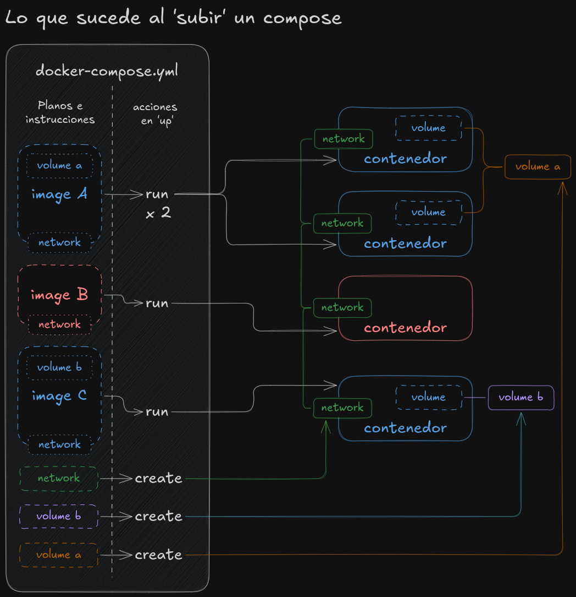

## Composición y Orquestación con Docker Compose

Hasta ahora hemos visto cómo gestionar un solo contenedor a la vez, lo cual funciona bien para aplicaciones sencillas. Pero ¿qué pasa cuando la aplicación se vuelve más compleja y necesita varios servicios, como una base de datos, un _backend_ y un _frontend_? Gestionar cada contenedor por separado, con sus comandos `docker run` largos y llenos de banderas (`-d`, `-p`, `--name`, `--network`, `-v`), se vuelve una tarea tediosa y propensa a errores.

Aquí es donde entra en juego la **composición** de contenedores, una forma de definir y ejecutar un _stack_ completo de aplicaciones. La herramienta más usada para esto es **Docker Compose**, que nos permite describir toda nuestra arquitectura en un solo archivo de configuración (`docker-compose.yml` o `compose.yml`). En lugar de escribir comandos largos, simplemente ejecutas un solo comando y Docker Compose se encarga de crear, enlazar y gestionar todos los servicios.

### El archivo `docker-compose.yml`

El corazón de Docker Compose es un archivo en formato YAML que describe los servicios, redes y volúmenes de tu aplicación. Es declarativo, lo que significa que describes el estado final que deseas, y Compose se encarga de lograrlo.



Un archivo `compose.yml` típico tiene la siguiente estructura:

```yaml
# 1. Versión de la sintaxis
version: '3.8'

# 2. Definición de los servicios
services:
  # El primer servicio, nuestra aplicación frontend
  frontend:
    build: ./front
    ports:
      # Exponemos solo el puerto del frontend al host
      - "80:80"
    networks:
      - my-app-network
    environment:
      - API_URL=http://backend:3000

  # El segundo servicio, nuestra aplicación backend
  backend:
    build: ./server
    networks:
      - my-app-network
    # El puerto 3000 del backend no es expuesto al host,
    # solo es accesible desde la red interna 'my-app-network'
    environment:
      - DB_HOST=database
      - DB_USER=${POSTGRES_USER} 
      - DB_PASSWORD=${POSTGRES_PASSWORD}
      - DB_NAME=${POSTGRES_DB}
 # las variables de entorno se halan desde el .env en el mismo 
 # directorio del archivo compose y se insertan ${MI_VARIABLE}

  # El tercer servicio, la base de datos
  database:
    image: postgres:14-alpine
    volumes:
      - db-data:/var/lib/postgresql/data
    networks:
      - my-app-network
    # El puerto de la base de datos no es expuesto al host
    environment:
      - POSTGRES_DB=${POSTGRES_DB}
      - POSTGRES_USER=${POSTGRES_USER}
      - POSTGRES_PASSWORD=${POSTGRES_PASSWORD}

# SI SE USAN VOLUMES Y NETWORKS EN LA COMPOSICÓN, ES NECESARIO
# ENUNCIARLOS, ASÍ NO TENGAN UNA CONFIGURACIÓN ESPECIAL
# 3. Definición de los volúmenes
volumes:
  db-data:

# 4. Definición de las redes
networks:
  my-app-network:
    driver: bridge
```

* **version**: Define la versión de la sintaxis de Compose. Aunque no es indispensable, es una buena práctica usar una de las últimas versiones estables.
* **services**: Aquí se definen todos los contenedores de tu aplicación. Cada servicio (por ejemplo, `frontend`, `backend` y `database`) corresponde a un contenedor.
  * **build**: Si tu servicio se construye a partir de un `Dockerfile` en tu proyecto, usa `build: .` para indicar que lo busque en el directorio actual.
  * **image**: Si el servicio usa una imagen ya existente (como `postgres:14-alpine`), se especifica aquí.
  * **ports**: Define qué puertos del contenedor se mapean a los puertos del host.
  * **volumes**: Mapea volúmenes nombrados o directorios locales (como `.:/app`) para que los datos persistan o se sincronicen en tiempo real.
  * **environment**: Establece las variables de entorno para el contenedor. Puedes cargar variables directamente del archivo `compose.yml` o, como buena práctica, usar un archivo `.env` para las variables sensibles. Docker Compose cargará automáticamente las variables de un archivo `.env` si se encuentra en el mismo directorio que el archivo `compose.yml`.
* **volumes**: Esta sección es donde defines los volúmenes con nombre (`db-data`). De esta manera, Docker Compose se encarga de crear y gestionar el volumen para ti, asegurando que los datos de tu base de datos no se pierdan.
* **networks**: Esta sección te permite definir redes personalizadas. Al conectar todos los servicios a la misma red (`my-app-network`), estos pueden comunicarse entre sí utilizando sus nombres de servicio como nombres de host. Por ejemplo, el servicio `backend` puede acceder a la base de datos simplemente usando `database` como su dirección de host, y el `frontend` puede comunicarse con el `backend` usando `backend`.

#### La importancia de los nombres en la composición

Una de las grandes ventajas de Docker Compose es que crea una red interna para todos los servicios definidos en el archivo. Dentro de esta red, los nombres de los servicios (ej. `frontend`, `backend`, `database`) actúan como nombres de host. Esto simplifica enormemente la comunicación entre contenedores, ya que no necesitas conocer sus direcciones IP internas. En el caso del ejemplo, el front se comunicaría con el back a través de la ruta `http://backend:3000`, suponiendo que 3000 es el puerto establecido internamente dentro de la aplicación de back... y el back se comunicaría con la base de datos a través del host `database` y si no se hizo cambio de puerto en Postgresql, el puerto sería 5432.

> [!TIP]
> **Exponer solo el puerto del _frontend_**: En un entorno de producción, es una buena práctica de seguridad exponer al mundo exterior (el host) solo los servicios que realmente lo necesitan. En nuestro ejemplo, solo el `frontend` necesita ser accesible desde el navegador del usuario. El `backend` y la `database` solo necesitan comunicarse entre sí, por lo que sus puertos no se exponen al host. Esto reduce la superficie de ataque y mantiene los servicios internos protegidos.

### Comandos de Docker Compose

```bash
# Inicia todos los servicios definidos en el archivo
#                 (detached) para que se ejecuten en segundo plano
#                  |
docker compose up -d

#               Permite especificar la ruta del archivo con el compose
#               de no asignarse, busca por default docker-compose.yml
#               en el directorio actual
#               |
docker compose -f ./mi-compose.yml up -d

# Detiene y elimina los contenedores, redes y volúmenes anónimos
docker compose down

#               Permite especificar la ruta del archivo 
#               con el compose que está corriendo
#               |
docker compose -f ./mi-compose.yml down

# Muestra el estado de todos los servicios de compose activos
docker compose ps

# Construye las imágenes de los servicios que usan 'build'
docker compose build

# Inicia los servicios nuevamente después de un cambio en el código
docker compose up --build -d

# Ejecuta un comando dentro de un servicio en ejecución
docker compose exec backend npm test
```

[Siguiente: Recomendaciones](./recomendaciones.md)

[Volver al listado de contenidos](#contenidos)
