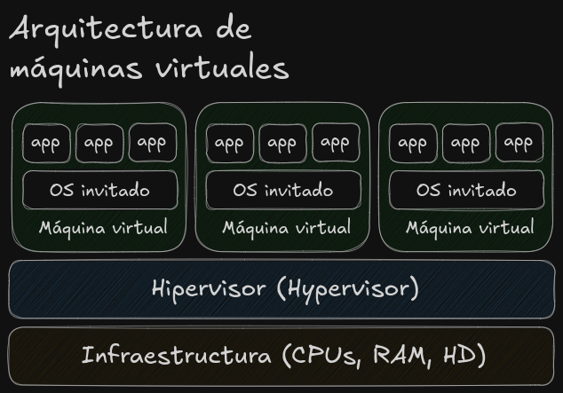
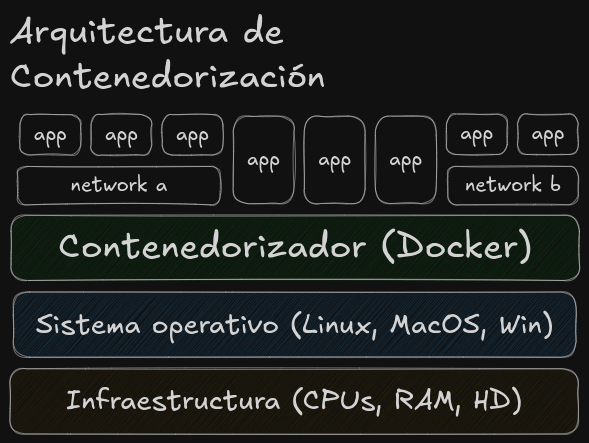

# Contenedores

## Intro: Máquinas, VM y contenedores

Sin entrar mucho en detalles, partiremos de que un computador es, una **máquina**, con un procesador, una RAM y un disco duro, que son administrados por un sistema operativo, sobre el cual corren nuestras aplicaciones. Estas aplicaciones solicitan recursos de memoria y cómputo a la máquina por medio del sistema operativo para ejecutarse correctamente.

Una **máquina virtual (VM - Virtual Machines)** emula todo el hardware de un computador. Esto permite instalar un sistema operativo completo dentro de otro, como si fuese un computador dentro de otro y usar los recursos del computador donde corre de forma compartida con otras VM. Cada VM tiene su propio kernel, su propio sistema de archivos y acceso virtualizado a recursos como red, disco o CPU. Esto garantiza un entorno completamente aislado, pero con un costo: levantar una VM implica cargar un sistema operativo completo, lo cual consume más tiempo y recursos.

Un **contenedor**, en cambio, no emula hardware ni instala un sistema operativo completo. Contenedoriza una aplicación junto con sus dependencias y la ejecuta directamente sobre el sistema operativo del de la máquina, compartiendo el mismo kernel. Cada contenedor se ejecuta en un entorno aislado gracias a mecanismos como _namespaces_ (para separar procesos, red, usuarios, etc.) y _cgroups_ (para limitar el uso de recursos).

> [!NOTE]
> Desde dentro, un contenedor se "siente" como una máquina independiente, pero en realidad está compartiendo recursos del sistema anfitrión de forma segura y eficiente. Por eso, los contenedores son mucho más ligeros y rápidos que las máquinas virtuales.

[Siguiente: Cómo funciona esto](./como_funciona_esto.md)
[Volver al listado de contenidos](../README.md#contenidos)
