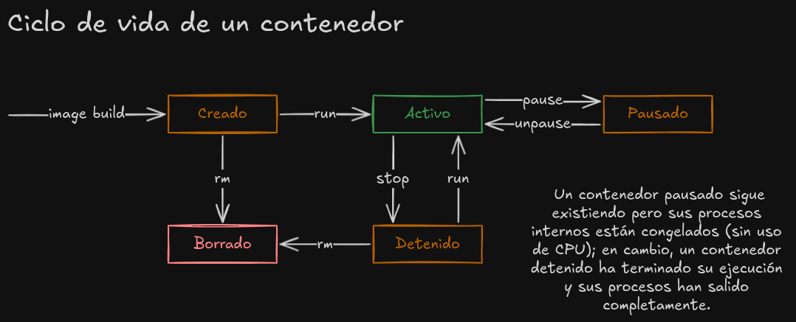

### La ejecución (los contenedores)

Sólo por recordar: Un **contenedor** es una instancia en ejecución de una imagen, que proporciona un entorno aislado y ligero para ejecutar una aplicación junto con todas sus dependencias. Aunque comparte el kernel del sistema operativo del host, cada contenedor tiene su propio sistema de archivos, red y procesos, lo que permite que se comporte como si fuera una máquina independiente. Esta separación asegura que las aplicaciones se ejecuten de forma consistente.

cuando ya tenemos las imágenes para nuestra aplicación, sean desde el docker hub (imágenes oficiales) o desde los builds de nuestro dockerfile, podemos ejecutarlas para crear los contenedores:

```bash
#      Inicia la construcción de la imagen
#      |
docker run mi-imagen
#          |
#          Nombre o id de mi imagen

#            Permite asignarle un nombre especial al contenedor
#            y trabajar con el usando algo mas memorable que un hash
#            |
docker run --name nombre-del-contenedor mi-imagen

# La ejecucion exitosa retorna id(hash) creado por docker del container

#           Ejecuta el comando y lo 'desacopla' de la terminal
#           |
docker run -d -p puertoA:puertoDeApp nombreUsuario/repo:tag
#              |                     
#              expone en el puertoA lo que encuentre en el puertoDeApp

# También podemos incliir las variables de entorno sensibles
#           Indica a docker que lo siguiente es un KEY=VALUE
#           para las variables de entorno
#           |
docker run -e API_KEY=1a2b3c4 -e PASSWORD=esUnSecreto ... nombre/repo
#                              |
#                              cada variable debe ir precedida por -e
```

Para detener la ejecución de uno o varios contenedores debemos conocer el id del contenedor:

```bash
#      Lista los procesos activos
#      |
docker ps

# esto nos retorna:
# CONTAINER ID  IMAGE        COMMAND  CREATED  STATUS  PORTS  ....
# 941ad3dddd8f  imgName:tag  "..."    3 days   Up...   0.0.0.0:5433 ...

#      Comando para detener la ejecución de uno o mas contenedores
#      |
docker stop 941ad3dddd8f # id_contenedor2 id_contenedor3
#           |
#           Id del container que quiero detener

# esto nos retorna los id de los contenedores detenidos
# 941ad3dddd8f

# Para detener todos los contenedores, usamos la magia de bash...
docker stop $(docker ps -q)
#                        |
#                        esta bandera hace que ps solo retorne el 
#                        listado de id

docker kill 941ad3dddd8f
#      |
#      Detiene la ejecución del contenedor a la fuerza, solo en
#      caso que 'stop' no funcione

# para ver TODOS los contenedores, activos e inactivos,
# agregamos la bandera -a
docker ps -a 
```



[Siguiente: La memoria (los volúmenes o _volumes_)](./la_memoria.md)

[Volver al índice](../README.md#contenidos)
