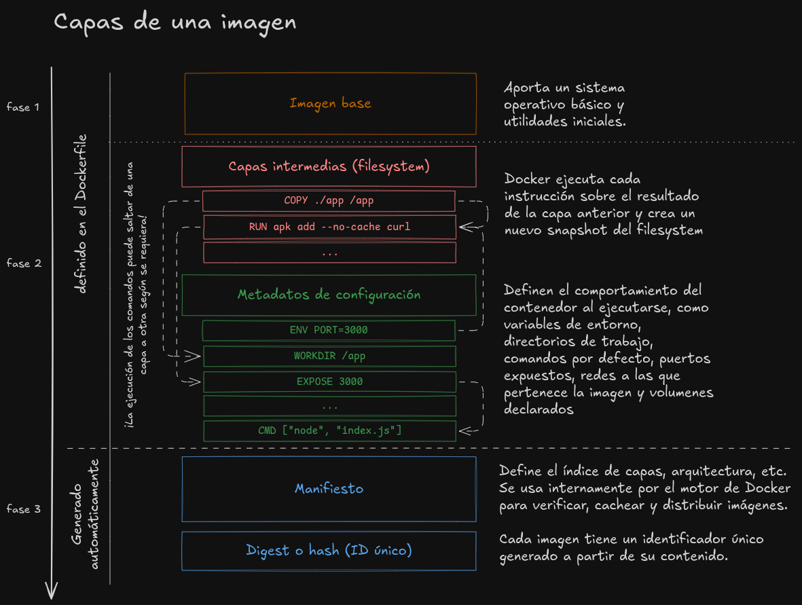

# Conceptos

## Cómo funciona esto

### Los planos (imágenes o _images_)

Uno de los fuertes de la contenedorización es la replicabilidad y la escalabilidad, es por esto que necesitamos unos planos consistentes que permitan generar cuantos contenedores necesitemos con exactamente la misma información. Acá es donde entran las _imágenes (images)_.

Una **imagen** es un archivo inmutable (de sólo lectura / readonly) que contiene todo lo necesario para ejecutar una aplicación: el sistema de archivos, las dependencias, configuraciones, variables de entorno, scripts de inicio, etc. Es como una plantilla del entorno que queremos replicar.

Es posible trabajar trabajar con imágenes creadas y optimizadas por otros...

```bash
#      comando para importar un contenedor
#      |
docker pull docker/getting-started
#           |
#           ruta a la ubicación de la imagen

# anatomía de la ubicación de las imágenes:
# docker pull [REGISTRO/][USUARIO/]REPO[:TAG]

docker pull ubuntu
# usa Docker Hub por defecto, imagen oficial `ubuntu`, última versión

docker pull nginx:1.25
# imagen oficial `nginx` con un tag o etiqueta específica, si no se 
# especifica uno, equivale a imagen:latest
    
docker pull docker/getting-started 
# imagen del usuario/organización `docker`, repositorio `getting-started
# tambien puede ser entendido como nombreUsuarioHub/repositorio
    
docker pull ghcr.io/owner/repo:tag
# imagen alojada en GitHub Container Registry
    
docker pull registry.example.com/proyecto/app:latest
# imagen desde un registro privado
```

o crear nuestras propias imágenes, estas se construyen usualmente a partir de un archivo llamado `Dockerfile` (Primera en mayúscula y sin extensión) en la raíz de nuestro proyecto, que define paso a paso cómo se arma esa imagen: desde qué base parte, qué dependencias instala, qué archivos copia y qué comando ejecuta por defecto.

```dockerfile
# 1. No es necesario reinventar siempre la rueda, partimos de la imagen base
# oficial en docker hub. Es mejor partir de la imágenes oficiales, 
# pues ya están optimizadas tanto por estructura como por rendimiento,
# en este ejemplo usamos la de node y con el tag :24-alpine3.21
FROM node:24-alpine3.21

# 1.1 Asignamos las variables de entorno
# NO COLOCAR VARIABLES DE ENTORNO DELICADAS (pass o keys) ACÁ
ENV NODE_ENV=production
ENV PORT=3000

# 2. creamos y asignamos el directorio de trabajo
WORKDIR /app

# 3. copiamos los archivos base para correr la app
COPY package*.json ./

# 4. corremos la instalación de dependencias
RUN npm install

# 3.1 ahora copiamos los archivos de nuestra app
# esto es por optimización y cache, ver el párrafo siguiente
COPY . .

# Exponemos el puerto que usará la app
EXPOSE 3000

# Comando para iniciar la aplicación
CMD ["npm", "start"]

```

El orden de los comandos en un `Dockerfile` es clave porque Docker construye la imagen paso a paso y guarda una **capa intermedia en caché** después de cada instrucción. Si un paso no ha cambiado desde la última vez, Docker reutiliza la capa en lugar de rehacerla, lo que acelera la construcción. Por eso en nuestro ejemplo (y como buena práctica) colocamos primero los pasos menos propensos a cambiar, como `COPY package*.json ./` y `RUN npm install`, antes de copiar el resto del código. Así, si solo cambias los archivos fuente pero no las dependencias, Docker podrá aprovechar el cache y evitar reinstalar todo, haciendo el proceso mucho más eficiente.



una vez tenemos nuestro `Dockerfile`, podemos crear la imagen para nuestro contenedor desde el directorio donde se encuentra el archivo.

```bash
#      Comando para crear la imagen
#      |
docker build -t mi-super-duper-app-en-node:1.0.0
#            |  |                          |
#            |  nombre de la app    Tag, si especifica es 'latest' pero
#            |                      se recomienda versionado semántico
#            | 
#            Bandera para especificar nombre de la imagen
```

Las imágenes creadas con Docker se almacenan localmente en el sistema de archivos del host, dentro del espacio de almacenamiento gestionado por Docker (normalmente en `/var/lib/docker` en sistemas Linux). No se guardan como archivos visibles en el proyecto, sino como capas internas que Docker gestiona y reutiliza. Puedes verlas con el comando `docker images`, y se mantienen disponibles localmente hasta que las elimines manualmente.

```bash
#      comando para ver las imágenes disponibles en nuestro equipo:
#      |
docker images
# es lo mismo que
docker image ls
# pero docker image es el comando para acceder al scope de image

# que retorna:
# REPOSITORY     TAG               IMAGE ID       CREATED       SIZE
# nombreImagen   17.5-alpine3.22   fbe21607052b   5 weeks ago   398MB
```

> [!NOTE]
> **Imagen Vs. Contenedor**: Una **imagen** es una definición de solo lectura que actúa como plantilla para crear contenedores. Un **contenedor**, en cambio, es una instancia activa basada en esa imagen, con su propio sistema de archivos de lectura-escritura, procesos y red. Es decir, la imagen es el plano; el contenedor, la ejecución real.

#### Cosas que no queremos contenedorizar (_dockerignore_)

Cuando Docker construye una imagen, al usar el comando `build`, se copian todos todos los archivos del directorio especificado en la instrucción `copy` para crear el build context. Pero no siempre queremos que todo se incluya. Así como `.gitignore` le dice a Git qué archivos no debe rastrear, el archivo `.dockerignore` le indica a Docker qué archivos debe excluir al construir una imagen. este archivo nos ayuda especificar qué debe excluirse del contexto de construcción. Con esto evitamos subir archivos pesados o irrelevantes (como node_modules o dist/), aceleramos el proceso de build y protegemos archivos sensibles como .env o claves.

Un .dockerignore típico podría verse así:

```bash
node_modules
dist
*.log
.env
.git
```

[Siguiente: La ejecución (los contenedores)](./la_ejecucion.md)

[Volver al listado de contenidos](../README.md#contenidos)
